# NEXUS BHUTAN — User Flow Diagrams

**Last Updated**: 2026-04-25
**Scope**: All vendor (POS staff) and consumer flows including WhatsApp interactions.

---

## VENDOR FLOWS

### V1. Authentication

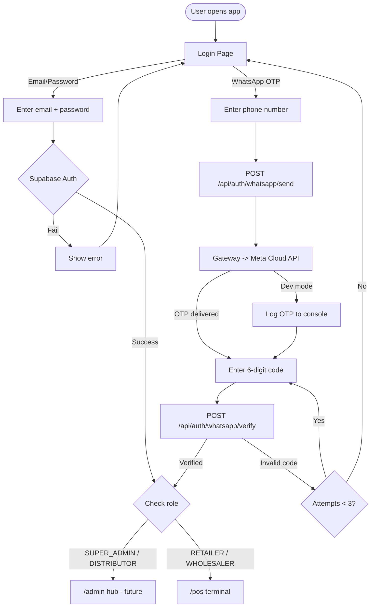

---

### V2. POS Sale (Main Checkout)

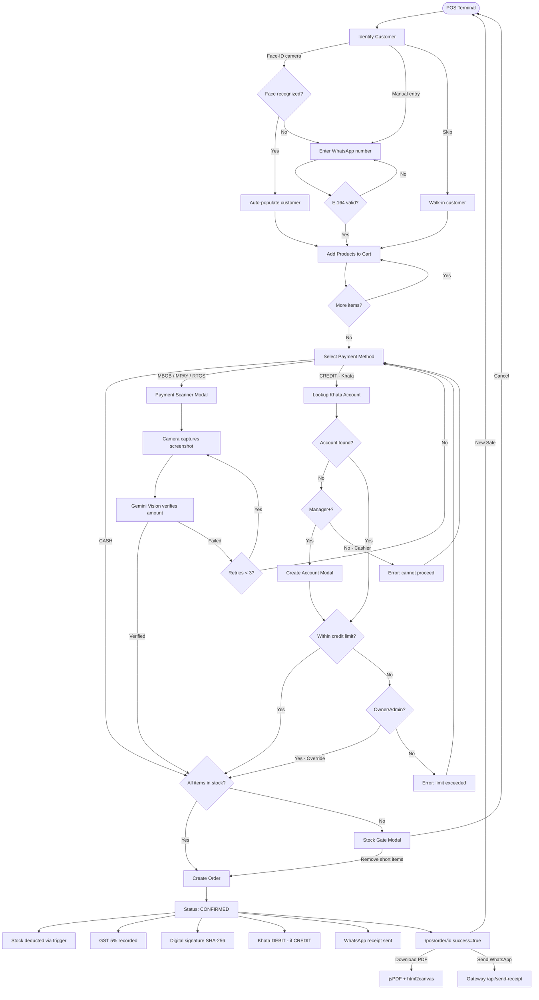

---

### V3. Order Management

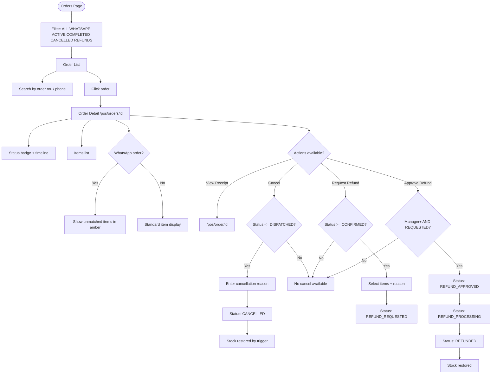

---

### V4. Inventory Management

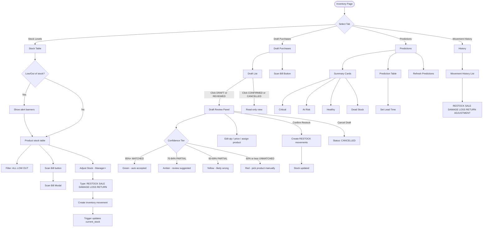

---

### V5. Photo-to-Stock Detail Flow

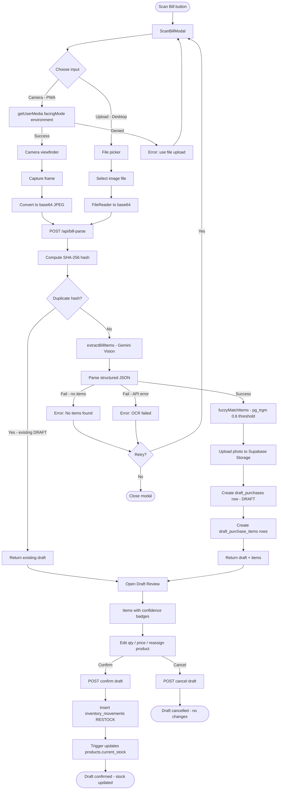

---

### V6. Khata Credit Management

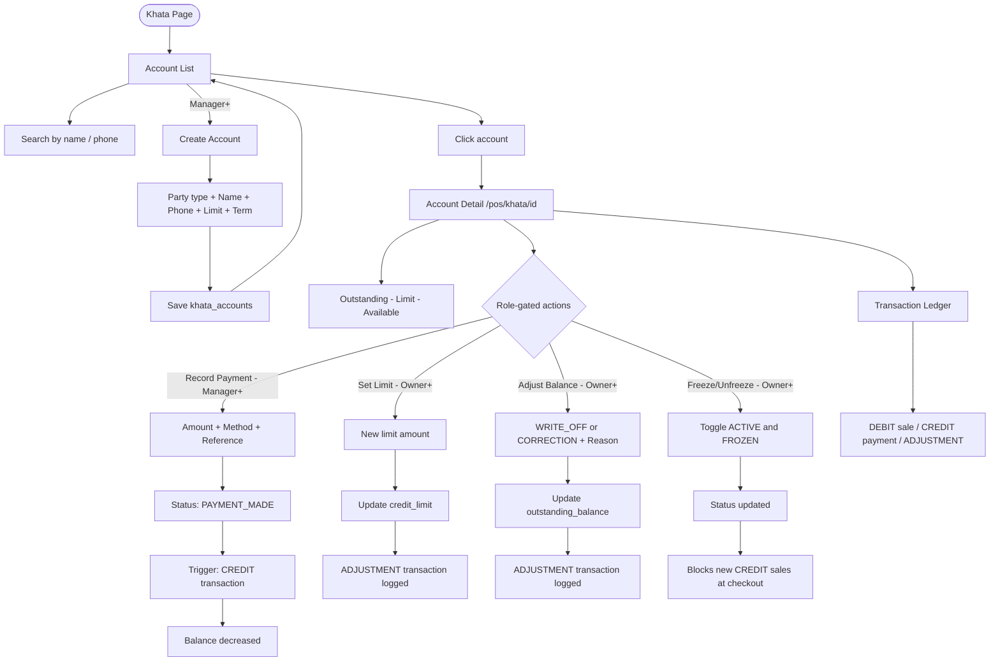

---

## CONSUMER FLOWS

### C1. Marketplace Browsing

```mermaid
flowchart LR
    CONSUMER([Consumer]) --> BROWSE["/shop/store-slug"]
    BROWSE --> STORE["Store header: name + logo + bio"]
    STORE --> CATS[Products by category]
    CATS --> PRODUCT["Product card: image + name + price"]
    PRODUCT --> ORDER_BTN["Order via WhatsApp - gold button"]
    ORDER_BTN --> WA_LINK[wa.me deep link opens]
    WA_LINK --> MSG["Hi, order Product from Store. Ref: slug"]
    MSG --> WHATSAPP([WhatsApp chat])
```

---

### C2. WhatsApp Ordering — End to End

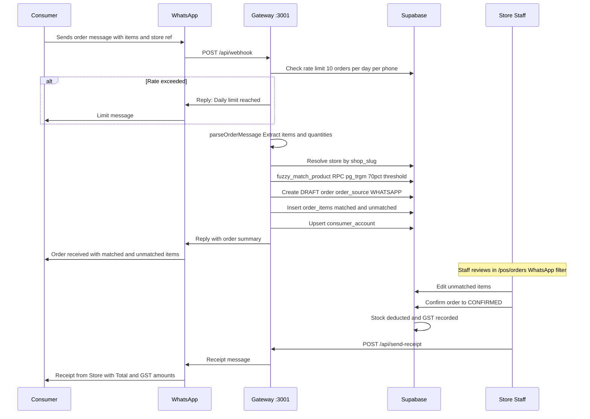

---

### C3. WhatsApp OTP Login

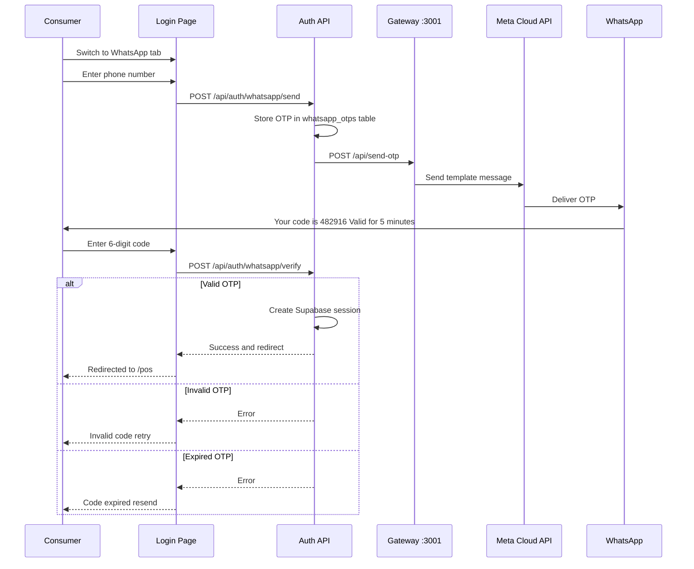

---

### C4. WhatsApp Receipt Delivery

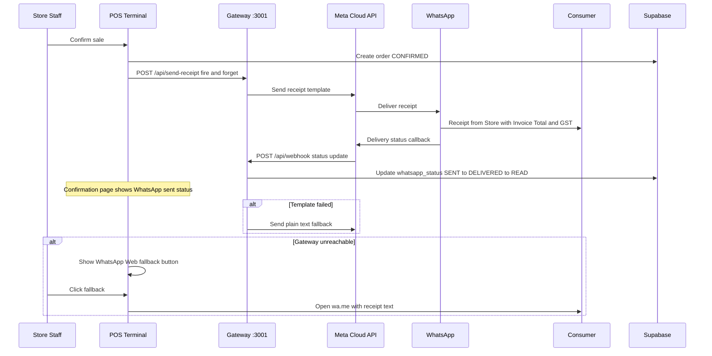

---

### C5. WhatsApp Credit Alerts

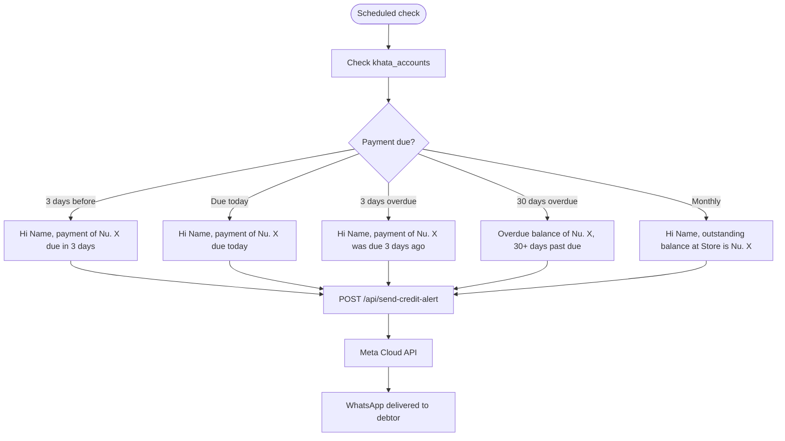

---

### C6. WhatsApp Stock Alerts

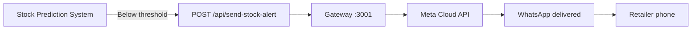

---

## ORDER STATE MACHINE

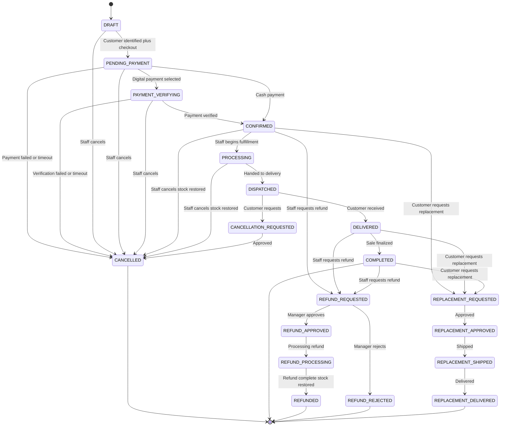

---

## PERMISSIONS MATRIX

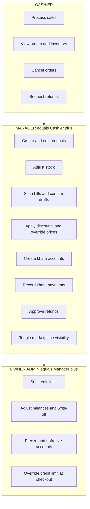

---

## SYSTEM DATA FLOW

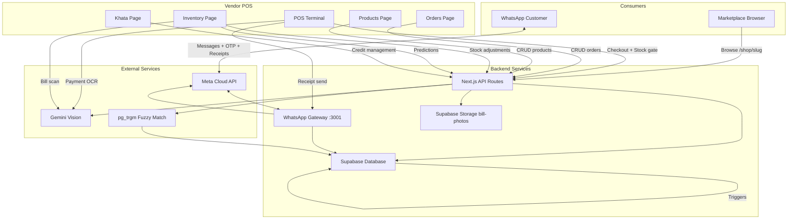

---

## WHATSAPP MESSAGE FLOW — END TO END

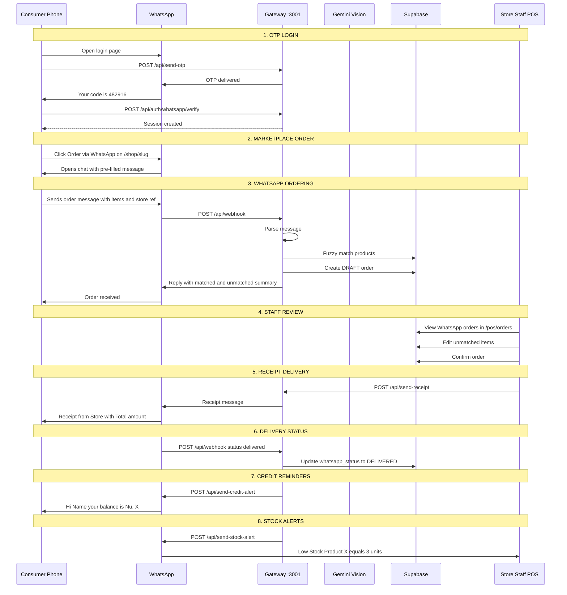
